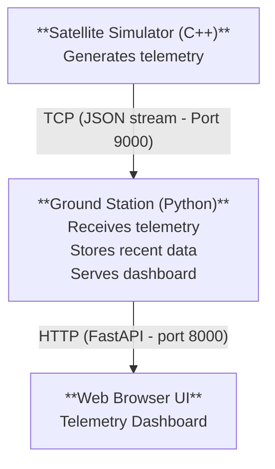
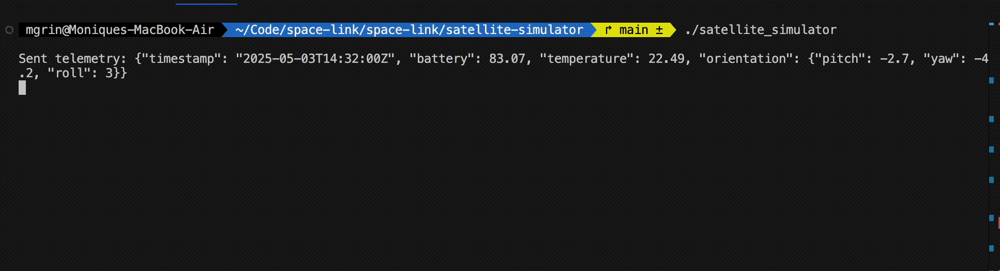
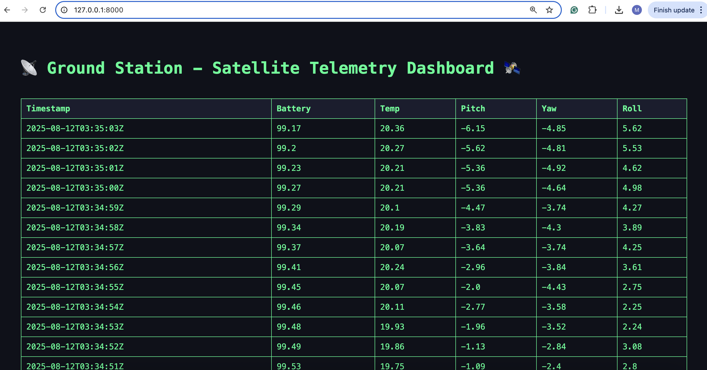

# SPACE LINK

This project simulates a basic satellite that sends telemetry data (in JSON format) over a TCP socket to a ground station. It’s a minimal demo of how real-world space systems communicate telemetry from spacecraft to Earth.


## Architecture



## Requirements

### C++ Satellite Simulator
- C++11 or later
- `g++` compiler
- Unix-like system (Linux/macOS)

### Python Ground Station
- Python 3.x
- `fastapi`, `uvicorn`, `jinja2`

## Instructions

### 1. Clone this repository
```bash
git clone https://github.com/mgrinstein/space-link.git
cd space-link
```

### 2. Compile the Satellite Simulator (Telemetry sender)

```bash
cd satellite-simulator
g++ -std=c++11 -o satellite_simulator main.cpp
```

### 3. Run the Ground Station (Receiver)
In a separate terminal, run:
```bash
cd ground-station-receiver
python3 main.py
```

### 4. Run the Satellite Simulator
Back in the simulator terminal, run:
```bash
cd satellite-simulator
./satellite_simulator
```

Telemetry will start being printed on the terminal:



It will also be received in the web interface dashboard (http://127.0.0.1:8000):



